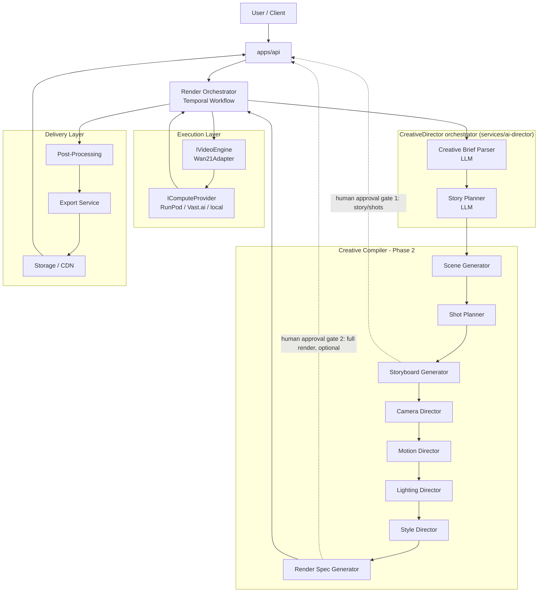
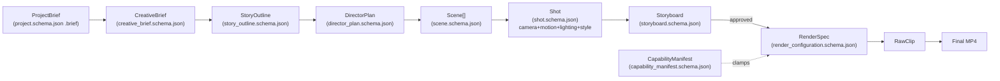

# Architecture

## 1. Core rule

The LLM layer (**AI Director**) and the video execution layer (**Video
Engine**) never call each other directly. They exchange only structured,
versioned JSON conforming to `packages/schemas/json/`. This is what lets
either side be replaced without rewriting the rest of the system. See
[ADR 0001](adr/0001-director-engine-separation.md).

## 2. High-level pipeline



See [ADR 0007](adr/0007-pipeline-stage-terminology-and-ordering.md) for
why the storyboard approval gate sits right after Shot Planner (cheapest
possible checkpoint: catches a wrong story/shot breakdown before any
per-shot camera/lighting/motion/style planning runs) rather than at the
end of the Creative Compiler.

## 3. Data flow contracts



`CreativeBrief` and `StoryOutline` are intermediate artifacts internal to
`CreativeDirector` — persisted in `packages/director-memory` for the
revision loop, but not part of the public API contract
(`docs/api/openapi.yaml`), which only exposes `DirectorPlan` and later.

## 4. Module responsibilities

See each module's own `README.md` for the authoritative, detailed
description. Summary:

| Layer | Module | Path | Status |
|---|---|---|---|
| Creative Director | CreativeDirector (orchestrator) | `services/ai-director` | **Implemented** |
| Creative Director | Creative Brief Parser | `services/creative-brief-parser` | **Implemented** |
| Creative Director | Story Planner | `services/story-planner` | **Implemented** |
| Creative Compiler | Scene Generator | `services/scene-builder` | **Implemented** (deterministic) |
| Creative Compiler | Shot Planner | `services/shot-planner` | **Implemented** (deterministic) |
| Creative Compiler | Prompt Builder | `services/prompt-builder` | Phase 2 |
| Creative Compiler | Storyboard Generator | `services/storyboard-generator` | Phase 2 |
| Creative Compiler | Camera Director | `services/camera-engine` | Phase 2 |
| Creative Compiler | Motion Director | `services/motion-engine` | Phase 2 |
| Creative Compiler | Lighting Director | `services/lighting-engine` | Phase 2 |
| Creative Compiler | Style Director | `services/style-engine` | Phase 2 |
| Creative Compiler | Render Spec Generator | `services/render-config-compiler` | Phase 2 |
| Execution | Video Engine Adapter (Wan2.1) | `services/video-engine-adapter` | Phase 3 (structurally complete) |
| Execution | Render Orchestrator | `services/render-orchestrator` | Phase 4 |
| Execution | GPU Worker container | `workers/gpu-worker` | Phase 3 |
| Delivery | Post-Processing | `services/post-processing` | Phase 5 |
| Delivery | Export Service | `services/export-service` | Phase 5 |
| Cross-cutting | Asset Manager | `services/asset-manager` | Phase 3 |
| Cross-cutting | Config SDK | `packages/config-sdk` | Implemented |
| Cross-cutting | Observability | `packages/observability` | Phase 4 |
| Cross-cutting | Director Memory | `packages/director-memory` | **Implemented** |
| Contracts | Schemas | `packages/schemas` | **Implemented** |
| Contracts | LLM Provider interface | `packages/llm-providers` | **Implemented** |
| Contracts | Prompt template engine | `packages/prompt-engine` | **Implemented** |
| Contracts | Video Engine / Compute Provider interfaces | `packages/video-engine-sdk` | Implemented (interfaces); adapters Phase 3 |
| Content | Prompt Library (video-gen fragments) | `libraries/prompt-library` | Seeded |
| Content | Prompt Templates (LLM director prompts) | `libraries/prompt-templates` | **Implemented** |
| Content | Template Library (DirectorPlan genre templates) | `libraries/template-library` | Seeded |
| Future | Training (custom foundation model) | `services/training` | Phase 8 |

"Creative Director" here is the same layer the rest of this document
calls the **AI Director** / **Creative Intelligence Layer** — see
[ADR 0007](adr/0007-pipeline-stage-terminology-and-ordering.md) for the
full terminology mapping.

## 5. The two swap points

```
Today:                              Later:
Claude ──┐                          Any LLM ──┐
         ├─ ILLMProvider                      ├─ ILLMProvider
         ┘                                    ┘

Wan2.1 ──┐                          My Foundation Model ──┐
         ├─ IVideoEngine                                  ├─ IVideoEngine
         ┘                                                ┘

RunPod/Vast.ai ──┐                  Kubernetes GPU pool ──┐
                 ├─ IComputeProvider                       ├─ IComputeProvider
                 ┘                                         ┘
```

Three independent axes of change, three independent interfaces. See
[ADR 0001](adr/0001-director-engine-separation.md) and
[ADR 0002](adr/0002-compute-provider-abstraction.md).

## 6. Technology stack

| Concern | Choice | ADR |
|---|---|---|
| Backend language | Python everywhere (FastAPI services) | [0003](adr/0003-language-python.md) |
| Workflow orchestration | Temporal.io, isolated behind the Render Orchestrator | [0004](adr/0004-workflow-engine-temporal.md) |
| GPU compute (Phase 0-3) | RunPod Serverless + rented Vast.ai instances | [0005](adr/0005-gpu-provider-runpod-vastai-first.md) |
| GPU compute (Phase 7+) | Kubernetes GPU node pool, via a new `IComputeProvider` | [0005](adr/0005-gpu-provider-runpod-vastai-first.md) |
| Database | PostgreSQL | — |
| Cache / queue backing | Redis | — |
| Object storage | MinIO locally, S3/R2 in production | — |
| Vector store (Phase 2+) | Qdrant or pgvector | — |
| Schema validation | JSON Schema (`packages/schemas`) + `jsonschema` at runtime boundaries | — |
| LLM prompt templating | Jinja2, versioned YAML files (`packages/prompt-engine` + `libraries/prompt-templates`) | [0006](adr/0006-structured-output-retry-decorator.md) |
| Structured output enforcement | Anthropic tool-use forced `tool_choice` + `RetryingLLMProvider` schema-validate-and-retry decorator | [0006](adr/0006-structured-output-retry-decorator.md) |
| Package/workspace management | `uv` workspace (`pyproject.toml` at root) | — |
| Local dev | `docker-compose.yml` (Postgres, Redis, MinIO, optional Temporal dev server) | — |

## 7. Repository

This is `sallehly-ai-video-engine`, deliberately a separate repository
from the `sallehly_app` Flutter product — the video platform is an
independent product, not a feature of it.

## 8. Roadmap

| Phase | Deliverable | Status |
|---|---|---|
| **0 — Foundation** | Monorepo structure, JSON Schemas, `ILLMProvider`/`IVideoEngine`/`IComputeProvider` interfaces, Wan2.1 adapter spec + stub, API contract, local dev environment | Done |
| **1 — Creative Director MVP** *(this repo's current state)* | `ClaudeProvider.generate_structured` (real Anthropic SDK call, untested against the live API in this environment), `RetryingLLMProvider`, `CreativeBriefParser`, `StoryPlanner`, `SceneGenerator`, `ShotPlanner`, `CreativeDirector` orchestrator, `packages/prompt-engine` + versioned templates, `packages/director-memory`, end-to-end tested against `FakeLLMProvider` | Done |
| **2 — Creative Compiler** | Implement Prompt Builder, Storyboard Generator, Camera/Motion/Lighting/Style Directors, and the Render Spec Generator (`render-config-compiler`) | Next |
| **3 — Video Engine Adapter + Wan2.1** | Implement `Wan21Adapter`'s real inference call, `RunPodProvider`, one end-to-end text-to-video render | Not started |
| **4 — Orchestration** | Temporal workflow in Render Orchestrator, storyboard human-approval signal, retries | Not started |
| **5 — Post-Processing & Export** | Stitching, upscaling, color grade, audio, multi-format export | Not started |
| **6 — Frontend MVP** | `apps/web-dashboard`: brief → storyboard approval → render → download | Not started |
| **7 — Scale-out** | `VastAIProvider` completion, `KubernetesProvider`, autoscaling, caching, billing | Not started |
| **8 — Custom foundation model track** | `services/training`; new `IVideoEngine` implementation replacing/augmenting Wan2.1 | Not started |
