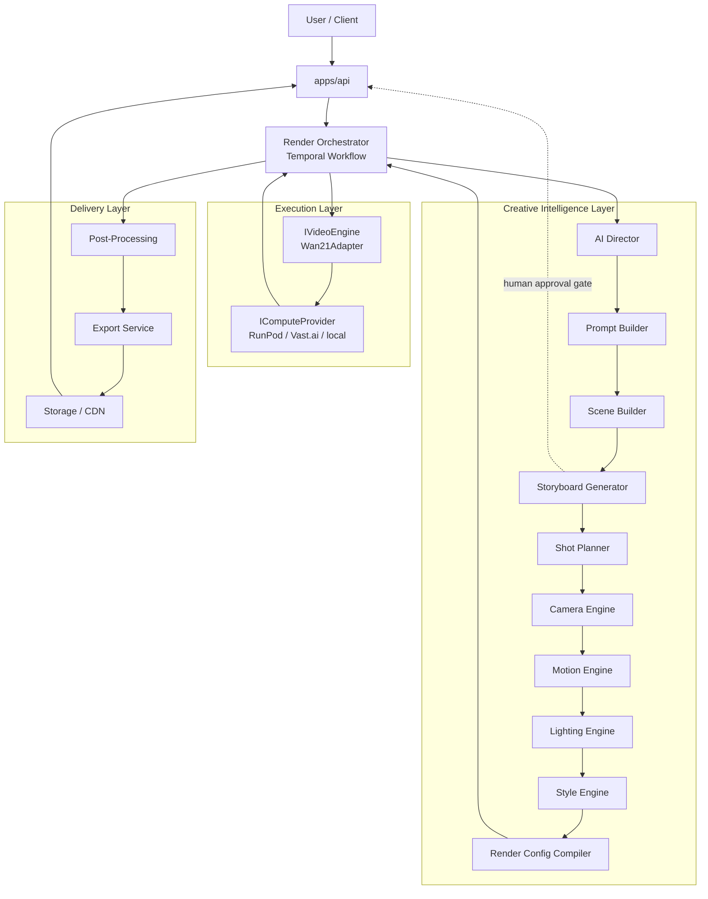
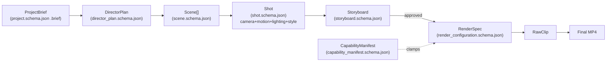

# Architecture

## 1. Core rule

The LLM layer (**AI Director**) and the video execution layer (**Video
Engine**) never call each other directly. They exchange only structured,
versioned JSON conforming to `packages/schemas/json/`. This is what lets
either side be replaced without rewriting the rest of the system. See
[ADR 0001](adr/0001-director-engine-separation.md).

## 2. High-level pipeline



## 3. Data flow contracts



## 4. Module responsibilities

See each module's own `README.md` for the authoritative, detailed
description. Summary:

| Layer | Module | Path |
|---|---|---|
| Intelligence | AI Director | `services/ai-director` |
| Intelligence | Prompt Builder | `services/prompt-builder` |
| Intelligence | Scene Builder | `services/scene-builder` |
| Intelligence | Storyboard Generator | `services/storyboard-generator` |
| Intelligence | Shot Planner | `services/shot-planner` |
| Intelligence | Camera Engine | `services/camera-engine` |
| Intelligence | Motion Engine | `services/motion-engine` |
| Intelligence | Lighting Engine | `services/lighting-engine` |
| Intelligence | Style Engine | `services/style-engine` |
| Intelligence | Render Configuration Compiler | `services/render-config-compiler` |
| Execution | Video Engine Adapter (Wan2.1) | `services/video-engine-adapter` |
| Execution | Render Orchestrator | `services/render-orchestrator` |
| Execution | GPU Worker container | `workers/gpu-worker` |
| Delivery | Post-Processing | `services/post-processing` |
| Delivery | Export Service | `services/export-service` |
| Cross-cutting | Asset Manager | `services/asset-manager` |
| Cross-cutting | Config SDK | `packages/config-sdk` |
| Cross-cutting | Observability | `packages/observability` |
| Contracts | Schemas | `packages/schemas` |
| Contracts | LLM Provider interface | `packages/llm-providers` |
| Contracts | Video Engine / Compute Provider interfaces | `packages/video-engine-sdk` |
| Content | Prompt Library | `libraries/prompt-library` |
| Content | Template Library | `libraries/template-library` |
| Future | Training (custom foundation model) | `services/training` |

## 5. The two swap points

```
Today:                              Later:
Claude ──┐                          Any LLM ──┐
         ├─ ILLMProvider                      ├─ ILLMProvider
         ┘                                    ┘

Wan2.1 ──┐                          My Foundation Model ──┐
         ├─ IVideoEngine                                  ├─ IVideoEngine
         ┘                                                ┘

RunPod/Vast.ai ──┐                  Kubernetes GPU pool ──┐
                 ├─ IComputeProvider                       ├─ IComputeProvider
                 ┘                                         ┘
```

Three independent axes of change, three independent interfaces. See
[ADR 0001](adr/0001-director-engine-separation.md) and
[ADR 0002](adr/0002-compute-provider-abstraction.md).

## 6. Technology stack

| Concern | Choice | ADR |
|---|---|---|
| Backend language | Python everywhere (FastAPI services) | [0003](adr/0003-language-python.md) |
| Workflow orchestration | Temporal.io, isolated behind the Render Orchestrator | [0004](adr/0004-workflow-engine-temporal.md) |
| GPU compute (Phase 0-3) | RunPod Serverless + rented Vast.ai instances | [0005](adr/0005-gpu-provider-runpod-vastai-first.md) |
| GPU compute (Phase 7+) | Kubernetes GPU node pool, via a new `IComputeProvider` | [0005](adr/0005-gpu-provider-runpod-vastai-first.md) |
| Database | PostgreSQL | — |
| Cache / queue backing | Redis | — |
| Object storage | MinIO locally, S3/R2 in production | — |
| Vector store (Phase 2+) | Qdrant or pgvector | — |
| Schema validation | JSON Schema (`packages/schemas`) + `jsonschema` at runtime boundaries | — |
| Package/workspace management | `uv` workspace (`pyproject.toml` at root) | — |
| Local dev | `docker-compose.yml` (Postgres, Redis, MinIO, optional Temporal dev server) | — |

## 7. Repository

This is `sallehly-ai-video-engine`, deliberately a separate repository
from the `sallehly_app` Flutter product — the video platform is an
independent product, not a feature of it.

## 8. Roadmap

| Phase | Deliverable |
|---|---|
| **0 — Foundation** *(this repo's current state)* | Monorepo structure, JSON Schemas, `ILLMProvider`/`IVideoEngine`/`IComputeProvider` interfaces, Wan2.1 adapter spec + stub, API contract, local dev environment |
| **1 — AI Director MVP** | Implement `ClaudeProvider.generate_structured`; validate DirectorPlan generation end-to-end against real briefs; seed Prompt/Template Library |
| **2 — Creative Compiler** | Implement Scene/Shot/Camera/Motion/Lighting/Style Planners and the Render Configuration Compiler |
| **3 — Video Engine Adapter + Wan2.1** | Implement `Wan21Adapter`'s real inference call, `RunPodProvider`, one end-to-end text-to-video render |
| **4 — Orchestration** | Temporal workflow in Render Orchestrator, storyboard human-approval signal, retries |
| **5 — Post-Processing & Export** | Stitching, upscaling, color grade, audio, multi-format export |
| **6 — Frontend MVP** | `apps/web-dashboard`: brief → storyboard approval → render → download |
| **7 — Scale-out** | `VastAIProvider` completion, `KubernetesProvider`, autoscaling, caching, billing |
| **8 — Custom foundation model track** | `services/training`; new `IVideoEngine` implementation replacing/augmenting Wan2.1 |
