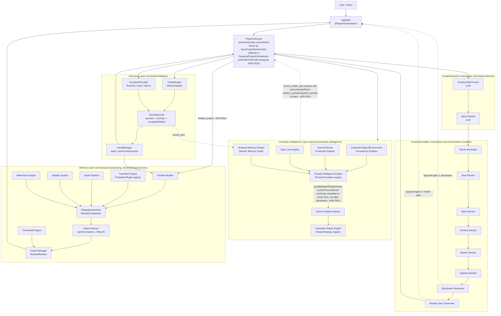

# Architecture

## 1. Core rule

The LLM layer (**AI Director**) and the video execution layer (**Video
Engine**) never call each other directly. They exchange only structured,
versioned JSON conforming to `packages/schemas/json/`. This is what lets
either side be replaced without rewriting the rest of the system. See
[ADR 0001](adr/0001-director-engine-separation.md).

## 2. High-level pipeline



See [ADR 0008](adr/0008-storyboard-after-technical-planning.md) for why
the Storyboard Generator runs after Camera/Motion/Lighting planning
(a storyboard frame needs to describe lens choice and lighting, which
don't exist until those Directors have run) rather than before it as
ADR 0007 originally had it, and why there are two approval gates -
storyboard (catches a wrong shot/camera/lighting plan) and render plan
(catches anything specific to the engine-compiled RenderSpecs, e.g. a
shot split for exceeding `max_shot_duration_sec`) - rather than one.
See [ADR 0010](adr/0010-persistence-and-lifecycle.md) for why
`ProjectLifecycle` is the single place that owns sequencing through both
gates and generation, with two interchangeable drivers (synchronous vs.
Temporal) sharing the exact same interface. See
[ADR 0012](adr/0012-post-production-pipeline.md) for the Delivery
Layer: real, ffmpeg-executable post-production (Timeline Builder,
Transition Engine, Audio Pipeline, Subtitle System, Watermark Engine,
`FfmpegCompositor`) and export (Export Service, Asset Packager) -
built and tested in Phase 6. See
[ADR 0013](adr/0013-cinematic-intelligence-layer.md) for the Cinematic
Intelligence Layer's ten engines (Character/Object/Environment
Consistency, Scene/Camera Continuity, Style Lock, Prompt Intelligence,
Temporal Memory + Director Memory Graph, Scene Quality Analyzer,
Automatic Repair) - rule-based and metadata-driven throughout, no
vision model in the loop. See
[ADR 0014](adr/0014-pipeline-integration.md) for how both are wired
into the live flow as of this phase:
`CinematicIntelligenceCoordinator.enrich_render_plan` runs inside
`ProjectLifecycle.approve_storyboard`/`reject_render_plan`, right after
the Render Spec Generator compiles a RenderPlan and before a human ever
reviews it at gate 2 - so `QualityReport`/`RepairAction` are scored from
*planned* continuity/style/camera metadata, not from inspecting
rendered pixels after a `GenerationJob` completes (still no vision
model - `QualityReport.embeddings_used: false`, ADR 0013 - just earlier
in the flow than ADR 0013's Consequences section originally
speculated). `ProjectLifecycle.finalize_project`, a new explicit step
past `COMPLETED`, hands the project's generated `AssetManager` records
to `PostProductionRunner`, which reuses the Delivery Layer unchanged to
produce a `RenderManifest`.

## 3. Data flow contracts

```mermaid
flowchart LR
    Brief["ProjectBrief<br/>(project.schema.json .brief)"] --> CB["CreativeBrief<br/>(creative_brief.schema.json)"]
    CB --> SO["StoryOutline<br/>(story_outline.schema.json)"]
    SO --> DP["DirectorPlan<br/>(director_plan.schema.json)"]
    DP --> Scene["Scene[]<br/>(scene.schema.json)"]
    Scene --> Shot["Shot<br/>(shot.schema.json)<br/>camera+motion+lighting+style"]
    Shot --> SB["Storyboard<br/>(storyboard.schema.json)<br/>gate 1"]
    SB -->|approved| RP["RenderPlan<br/>(render_plan.schema.json)<br/>gate 2"]
    CM["CapabilityManifest<br/>(capability_manifest.schema.json)"] -.clamps.-> RP
    RP -->|approved| RS["RenderSpec[]<br/>(render_configuration.schema.json,<br/>embedded in RenderPlan)"]
    PP["PromptPackage<br/>(prompt_package.schema.json)<br/>ADR 0014"] -->|fills positive/negative_prompt| RS
    RS --> GJ["GenerationJob<br/>(generation_job.schema.json)<br/>queued/running/completed/failed"]
    GJ --> Clip["RawClip"]
    Clip --> AR["AssetRecord<br/>(asset_record.schema.json)"]
    AR --> TL["Timeline<br/>(timeline.schema.json)"]
    TL --> Manifest["RenderManifest<br/>(render_manifest.schema.json)"]
    GJ -.updates.-> PM["ProjectMemory<br/>(project_memory.schema.json)"]
    PM -.feeds.-> PP
```



`CreativeBrief` and `StoryOutline` are intermediate artifacts internal to
`CreativeDirector` — persisted in `packages/director-memory` for the
revision loop, but not part of the public API contract
(`docs/api/openapi.yaml`), which only exposes `DirectorPlan` and later.

## 4. Module responsibilities

See each module's own `README.md` for the authoritative, detailed
description. Summary:

| Layer | Module | Path | Status |
|---|---|---|---|
| Creative Director | CreativeDirector (orchestrator) | `services/ai-director` | **Implemented** |
| Creative Director | Creative Brief Parser | `services/creative-brief-parser` | **Implemented** |
| Creative Director | Story Planner | `services/story-planner` | **Implemented** |
| Creative Compiler | CreativeCompiler (orchestrator) | `services/creative-compiler` | **Implemented** |
| Creative Compiler | Scene Generator | `services/scene-builder` | **Implemented** (deterministic) |
| Creative Compiler | Shot Planner | `services/shot-planner` | **Implemented** (deterministic) |
| Creative Compiler | Style Director | `services/style-engine` | **Implemented** (deterministic) |
| Creative Compiler | Camera Director | `services/camera-engine` | **Implemented** (deterministic) |
| Creative Compiler | Motion Director | `services/motion-engine` | **Implemented** (deterministic) |
| Creative Compiler | Lighting Director | `services/lighting-engine` | **Implemented** (deterministic) |
| Creative Compiler | Storyboard Generator | `services/storyboard-generator` | **Implemented** (deterministic) |
| Creative Compiler | Render Spec Generator | `services/render-config-compiler` | **Implemented** (deterministic) |
| Creative Compiler | Prompt Builder (dedicated fragment library) | `services/prompt-builder` | Not started - prompt composition is currently inline in Render Config Compiler |
| Execution | Video Engine Adapter (Wan2.1 + RunPod) | `services/video-engine-adapter` | **Implemented** (Wan2.1, RunPod, local); Vast.ai still a stub |
| Execution | `SallehlyModelAdapter` (second `IVideoEngine`, config-selectable via `VIDEO_ENGINE=sallehly-v1`) | `services/video-engine-adapter` | **Implemented** - real `capabilities()`; `build_job_payload`/`parse_result` raise `SallehlyModelNotTrainedError` (no weights yet - Phase 9) (ADR 0014) |
| Execution | GenerationPipeline (job lifecycle) | `services/render-orchestrator` | **Implemented** |
| Execution | ProjectLifecycle + SyncProjectOrchestrator | `services/render-orchestrator` | **Implemented** - now also runs Cinematic Intelligence enrichment (gate 2) and `finalize_project` (post-processing/export) (ADR 0014) |
| Execution | `ProjectGenerationWorkflow` + `TemporalProjectOrchestrator` (Temporal) | `services/render-orchestrator/workflows` | **Implemented and genuinely executed** - real `temporal` CLI dev server, real worker, `ORCHESTRATOR=temporal` selectable alongside the default `sync` driver (ADR 0015, supersedes ADR 0010's "not executable" for this specific path) |
| Execution | GPU Worker container | `workers/gpu-worker` | Structurally complete; real Wan2.1 inference call needs a GPU deployment step outside this environment |
| Delivery | API layer | `apps/api` | **Implemented** - full project lifecycle over real HTTP (incl. auth, plan/storyboard/render-plan retrieval, retry-generation, asset upload, cinematic intelligence, finalize/render-manifest), tested with `TestClient` |
| Delivery | Frontend (dashboard + creative workspace) | `apps/web-dashboard` | **Implemented** (Next.js App Router + TypeScript + Tailwind) - register/login, create project, review storyboard/render plan, Cinematic Intelligence panel, monitor generation, finalize/download export, asset library |
| Delivery | Post-Processing (Timeline Builder, Transition Engine, Audio Pipeline, Subtitle System, Thumbnail Engine, Watermark Engine, `FfmpegCompositor`) | `services/post-processing` | **Implemented** - real ffmpeg execution, tested against real synthetic clips (ADR 0012); wired into `ProjectLifecycle.finalize_project` via `PostProductionRunner` (ADR 0014) |
| Delivery | Export Service (format/quality-preset export, Asset Packager/RenderManifest) | `services/export-service` | **Implemented** - real ffmpeg re-encode to mp4/mov/webm x 720p/1080p/1440p/4K; wired into `ProjectLifecycle.finalize_project` (ADR 0014) |
| Delivery | Upscaling (video upscaling, frame interpolation) | `services/post-processing` (`upscaling.py`) | Interface prepared (`IUpscaler`), `PassthroughUpscaler` stub only - real upscaling needs a GPU deployment (ADR 0012) |
| Cinematic Intelligence | `CinematicIntelligenceCoordinator` (single integration point for all ten engines) | `services/cinematic-intelligence` (`coordinator.py`) | **Implemented** - `enrich_render_plan`/`get_project_report`/`improve_prompt`/`repair_shot`/`review_repair`/`list_repairs` against real `DirectorPlan`/`RenderPlan` data (ADR 0014) |
| Cinematic Intelligence | Character / Object / Environment Consistency Engines | `services/cinematic-intelligence` | **Implemented** - immutable `CharacterIdentityProfile`/mutable `ObjectProfile`/`EnvironmentProfile` (ADR 0013); reachable live via the coordinator, `ObjectConsistencyEngine` still not auto-populated from scene data (`DirectorPlan` has no object field yet - ADR 0014) |
| Cinematic Intelligence | Scene / Camera Continuity Engines | `services/cinematic-intelligence` | **Implemented** - rule-based `ContinuityReport`s from adjacent-shot metadata diffs |
| Cinematic Intelligence | Style Lock Engine / Reference Image Engine | `services/cinematic-intelligence` | **Implemented** - one `StyleLock` per project; `ReferencePackage`s consumable by the new model adapters below |
| Cinematic Intelligence | Prompt Intelligence Engine | `services/cinematic-intelligence` (`prompt_intelligence/`) | **Implemented** - `PromptOptimizer`/`NegativePromptBuilder`/`PromptCompressor`/`PromptScorer`/`PromptVersioning` + `IPromptTranslator` plugins (wan2.1/veo/runway/luma/kling/pika); now patches every `RenderSpec`'s `positive_prompt`/`negative_prompt` live at gate 2 (ADR 0014) |
| Cinematic Intelligence | Temporal Memory Engine / Director Memory Graph | `services/cinematic-intelligence` | **Implemented** - `ProjectMemory` per project; `InMemoryGraphStore` (`IGraphStore`), Neo4j-shaped for later |
| Cinematic Intelligence | Scene Quality Analyzer / Automatic Repair Engine | `services/cinematic-intelligence` | **Implemented** - rule-based `IQualityMetric`s (no vision model); `AutomaticRepairEngine` scoped to one shot at a time; both now run automatically during enrichment, exposed live via `/cinematic/repair` + approve/reject routes (ADR 0014) |
| Cinematic Intelligence | Model adapters: `ClipEmbeddingProvider`/`DinoEmbeddingProvider` (`IEmbeddingProvider`), `ControlNetConditioningAdapter`/`IPAdapterConditioningAdapter` (`IReferenceConditioningAdapter`) | `services/cinematic-intelligence` (`model_adapters/`) | **Implemented** - `ControlNetConditioningAdapter`'s default `preprocessor="canny"` runs real Pillow edge detection (no GPU needed); every other real-model path raises `ModelUnavailableError` (`torch`/`open_clip`/`torchvision`/`controlnet_aux`/`transformers` not installed here) (ADR 0014) |
| Cross-cutting | Asset Manager | `services/asset-manager` | **Implemented** - gained `list_for_project(project_id, kind=None)` for post-production/reporting (ADR 0014) |
| Cross-cutting | Auth | `packages/auth` | **Implemented** (`LocalAuthProvider`: PBKDF2 + bearer tokens via injected `ITokenStore` - `InMemoryTokenStore` default, `RedisTokenStore` real (`TOKEN_STORE=redis`, Phase 8 WP3, ADR 0017); optional token TTL + `refresh_token()` rotation (Phase 8 WP5, ADR 0020); personal workspace per user, no team model yet) |
| Cross-cutting | Security hardening | `packages/rate-limit-sdk`, `packages/quota-sdk`, `apps/api/src/api/middleware.py`/`rate_limit.py` | **Implemented** - `IRateLimiter` (`InMemoryRateLimiter`/`RedisRateLimiter`, `RATE_LIMITER=redis`) on auth + generation endpoints; `IQuotaEnforcer` (`InMemoryQuotaEnforcer`/`RedisQuotaEnforcer`, `QUOTA_ENFORCER=redis`) capping in-flight generations per workspace; `SecurityHeadersMiddleware`; upload content-type/size validation; `jobs.py` ownership check (Phase 8 WP5, ADR 0020) |
| Cross-cutting | Config SDK | `packages/config-sdk` | **Implemented** - gained `EMBEDDING_PROVIDER_REGISTRY`/`CONDITIONING_ADAPTER_REGISTRY` (ADR 0014) |
| Cross-cutting | Cache | `packages/cache-sdk` | **Implemented** - `InMemoryCache` (default) and `RedisCache` (real Redis, `CACHE_BACKEND=redis`) both implement `ICache` (Phase 8 WP3, ADR 0017) |
| Cross-cutting | Observability | `packages/observability` | **Implemented** - structured JSON logging + correlation ids, real OpenTelemetry tracing (`ConsoleSpanExporter` default, real `OTLPSpanExporter` available), Prometheus metrics (`/metrics`), `IErrorReporter` (`LoggingErrorReporter` default, `SentryErrorReporter` real-but-unverified) (Phase 8 WP1, ADR 0019) |
| Cross-cutting | Director Memory | `packages/director-memory` | **Implemented** |
| Cross-cutting | Project persistence | `packages/persistence` | **Implemented** - `InMemoryProjectStore` (default) and `PostgresProjectStore` (real Postgres, `PROJECT_STORE=postgres`) both implement `IProjectStore` (Phase 8 WP2, ADR 0016) |
| Cross-cutting | Event system | `services/render-orchestrator` (`events.py`, `redis_event_bus.py`) | **Implemented** - `InMemoryEventBus` (default) and `RedisEventBus` (real Redis pub/sub, `EVENT_BUS=redis`, fixes the single-process delivery limit) both implement `IEventBus` (Phase 8 WP3, ADR 0017) |
| Contracts | Schemas | `packages/schemas` | **Implemented** |
| Contracts | LLM Provider interface | `packages/llm-providers` | **Implemented** (Claude, local-heuristic offline default) |
| Contracts | Prompt template engine | `packages/prompt-engine` | **Implemented** |
| Contracts | Video Engine / Compute Provider interfaces | `packages/video-engine-sdk` | **Implemented** |
| Contracts | Render Compositor / Transition Plugin / Upscaler interfaces | `packages/video-composition-sdk` | **Implemented** |
| Contracts | Cinematic Intelligence interfaces (`IRepairStrategy`/`IPromptTranslator`/`IQualityMetric`/`IGraphStore`/`IEmbeddingProvider`/`IReferenceConditioningAdapter`) | `packages/cinematic-intelligence-sdk` | **Implemented** - last two now have concrete adapters (`services/cinematic-intelligence/model_adapters`), real where a technique needs no trained model (cosine similarity, Canny edge detection), `ModelUnavailableError` where it genuinely does (ADR 0014, supersedes ADR 0013's "prepared, not implemented") |
| Contracts | Storage abstraction | `packages/storage-sdk` | **Implemented** - `LocalFilesystemStorageProvider` (default) and `S3Provider` (real S3-compatible via `boto3`, `STORAGE_PROVIDER=s3`) both implement `IStorageProvider` (Phase 8 WP4, ADR 0018) |
| Content | Prompt Library (video-gen fragments) | `libraries/prompt-library` | Seeded |
| Content | Prompt Templates (LLM director prompts) | `libraries/prompt-templates` | **Implemented** |
| Content | Template Library (DirectorPlan genre templates) | `libraries/template-library` | Seeded |
| Future | Training (custom foundation model) | `services/training` | **Phase 9 Preparation implemented** (ADR 0021): training framework (`ITrainer`/`DryRunTrainer`, `TrainingConfig`/`LoRAConfig`, `ICheckpointStore`), dataset pipeline (ingest/caption/validate/dedup/split/statistics/version, real ffprobe-based), Model Registry (`IModelRegistry`, promotion/rollback/compatibility validation), evaluation framework (`BenchmarkRunner`, metrics, human eval, regression detection), and 7 base-model training configs (Wan2.1/HunyuanVideo/CogVideoX/Stable Video Diffusion/Wan2.2 x3 variants). **Training automation layer implemented** (ADR 0022): `automation/` submodule - real `KaggleClient`/`ModalJobLauncher` CLI wrappers, `CostGuard` (approval + monthly budget enforcement), `TrainingController`/`ExperimentConfigGenerator`, plus 3 GitHub Actions workflows (`.github/workflows/training-phase{1,2,3}-*.yml`) covering CPU dataset validation, scheduled free-GPU experiments, and a human-gated paid-GPU approval workflow. **Wan2.2 training execution layer implemented** (ADR 0023): `wan22/` submodule - real training entrypoint script (`entrypoints/wan22_lora_train.py`), `Wan22DatasetAdapter`, `Wan22LoRAConfig` (both-MoE-experts-paired-by-construction), `Wan22CheckpointWriter`, `Wan22LoRATrainer(ITrainer)`, `Wan22EvaluationHook`, and Kaggle/Modal dispatch wiring (`dispatch_via_kaggle`/`dispatch_via_modal`). CPU-only throughout - no GPU rented, no model downloaded, no training executed; the only real execution boundary (`IWan22TrainingBackend`) always raises `ModelUnavailableError`, proven by actually running the entrypoint end-to-end during development. Not yet wired into `apps/api` or any other service. Real model training itself remains Phase 9 |

"Creative Director" here is the same layer the rest of this document
calls the **AI Director** / **Creative Intelligence Layer** — see
[ADR 0007](adr/0007-pipeline-stage-terminology-and-ordering.md) for the
full terminology mapping.

## 5. The two swap points

```
Today:                              Later:
Claude ──┐                          Any LLM ──┐
         ├─ ILLMProvider                      ├─ ILLMProvider
         ┘                                    ┘

Wan2.1 ──┐                          My Foundation Model ──┐
         ├─ IVideoEngine                                  ├─ IVideoEngine
         ┘                                                ┘

RunPod/Vast.ai ──┐                  Kubernetes GPU pool ──┐
                 ├─ IComputeProvider                       ├─ IComputeProvider
                 ┘                                         ┘
```

Three independent axes of change, three independent interfaces. See
[ADR 0001](adr/0001-director-engine-separation.md) and
[ADR 0002](adr/0002-compute-provider-abstraction.md).

### Forward compatibility: image generation models

`storyboard.schema.json`'s `preview_image_asset_id` field and
`render_configuration.schema.json`'s `conditioning_images` field both
anticipate an image-generation engine (for cheap storyboard preview
frames, and for `image_to_video` conditioning inputs) without requiring
one to exist yet. When one is built, it follows the exact same pattern as
`IVideoEngine`/`IComputeProvider` (ADR 0002): a new `IImageEngine`
interface in a sibling package (e.g. `packages/image-engine-sdk`), reusing
`IComputeProvider` as-is since that interface is already generic over
"container image + JSON payload in, artifact URI out" and has no
video-specific assumptions. Neither field is populated by any Phase 0-2
code - this is a documented extension point, not a built feature.

## 6. Technology stack

| Concern | Choice | ADR |
|---|---|---|
| Backend language | Python everywhere (FastAPI services) | [0003](adr/0003-language-python.md) |
| Workflow orchestration | Temporal.io, isolated behind the Render Orchestrator | [0004](adr/0004-workflow-engine-temporal.md) |
| GPU compute (Phase 0-3) | RunPod Serverless + rented Vast.ai instances | [0005](adr/0005-gpu-provider-runpod-vastai-first.md) |
| GPU compute (Phase 8+) | Kubernetes GPU node pool, via a new `IComputeProvider` | [0005](adr/0005-gpu-provider-runpod-vastai-first.md) |
| Database | PostgreSQL | — |
| Cache / queue backing | Redis | — |
| Object storage | MinIO locally, S3/R2 in production | — |
| Vector store (Phase 2+) | Qdrant or pgvector | — |
| Schema validation | JSON Schema (`packages/schemas`) + `jsonschema` at runtime boundaries | — |
| LLM prompt templating | Jinja2, versioned YAML files (`packages/prompt-engine` + `libraries/prompt-templates`) | [0006](adr/0006-structured-output-retry-decorator.md) |
| Structured output enforcement | Anthropic tool-use forced `tool_choice` + `RetryingLLMProvider` schema-validate-and-retry decorator | [0006](adr/0006-structured-output-retry-decorator.md) |
| Compute provider HTTP client | `httpx` (sync client, `httpx.MockTransport` in tests) | [0009](adr/0009-generation-pipeline.md) |
| API framework | FastAPI + Pydantic request models, `fastapi.testclient.TestClient` in tests | [0010](adr/0010-persistence-and-lifecycle.md) |
| Durable workflow SDK | `temporalio` (Python SDK) - real workflow/activity code, genuinely executed against a real `temporal` CLI dev server as of Phase 8 WP6 | [0015](adr/0015-temporal-activation.md) |
| Post-production compositing | `ffmpeg`/`ffprobe` (system binary, invoked via `subprocess`) - real, executable, and exercised by real tests in this environment | [0012](adr/0012-post-production-pipeline.md) |
| Cinematic Intelligence Layer | Pure Python, rule-based/metadata-driven - no external binary, no vision model, no training | [0013](adr/0013-cinematic-intelligence-layer.md) |
| Cinematic Intelligence model adapters | Pillow (real Canny edge detection, always available); `torch`/`open_clip`/`torchvision`/`controlnet_aux`/`transformers` (optional, lazily imported, not installed in this environment) | [0014](adr/0014-pipeline-integration.md) |
| Package/workspace management | `uv` workspace (`pyproject.toml` at root) | — |
| Local dev | `docker-compose.yml` (Postgres, Redis, MinIO, optional Temporal dev server) | — |

## 7. Repository

This is `sallehly-ai-video-engine`, deliberately a separate repository
from the `sallehly_app` Flutter product — the video platform is an
independent product, not a feature of it.

## 8. Roadmap

| Phase | Deliverable | Status |
|---|---|---|
| **0 — Foundation** | Monorepo structure, JSON Schemas, `ILLMProvider`/`IVideoEngine`/`IComputeProvider` interfaces, Wan2.1 adapter spec + stub, API contract, local dev environment | Done |
| **1 — Creative Director MVP** | `ClaudeProvider.generate_structured` (real Anthropic SDK call, untested against the live API in this environment), `RetryingLLMProvider`, `CreativeBriefParser`, `StoryPlanner`, `SceneGenerator`, `ShotPlanner`, `CreativeDirector` orchestrator, `packages/prompt-engine` + versioned templates, `packages/director-memory`, end-to-end tested against `FakeLLMProvider` | Done |
| **2 — Creative Compiler** | Camera/Motion/Lighting/Style Directors, Storyboard Generator (gate 1), Render Specification Generator + `render_plan.schema.json` (gate 2), `CreativeCompiler` orchestrator, end-to-end tested from `FakeLLMProvider` through both approval gates | Done |
| **3 — Video Engine Adapter + Wan2.1** | `Wan21Adapter` completed (i2v conditioning mapping, seed handling, generation params), production `RunPodProvider` (real HTTP client, retry-with-backoff, tested against `httpx.MockTransport`), `GenerationPipeline` + `GenerationJob` lifecycle, `AssetManager` + `packages/storage-sdk`, engine/compute registries wired in `config_sdk`. Real GPU execution still needs `workers/gpu-worker` deployed with actual Wan2.1 weights - an infra step outside this environment | Done |
| **4 — Orchestration** | `ProjectLifecycle` (full create→plan→both gates→generate flow, with reject/regenerate on each gate), `packages/persistence` (`IProjectStore`), event system (`IEventBus`), `SyncProjectOrchestrator`, real `ProjectGenerationWorkflow`/activities (`temporalio`, structurally validated but not live-executable here), `apps/api` implementing the full project/job/asset endpoint surface, `LocalHeuristicLLMProvider` for a fully offline API. Tested end-to-end via `TestClient` including failure and regeneration paths | Done |
| **5 — User-Facing Platform** | `packages/auth` (`IAuthProvider`/`IUserStore`, personal workspace per user); `apps/api` additions (auth routes, ownership checks, `GET /projects` list, plan/storyboard/render-plan retrieval, `retry-generation`, `assets/upload`, CORS); `apps/web-dashboard` (Next.js App Router + TypeScript + Tailwind: login/register, project dashboard, creative workspace with lifecycle timeline/scene-shot cards/approval panels/real-time job status/asset library). Tested via Vitest (unit) + Playwright (real Chromium, full lifecycle e2e) against real `uvicorn`/`next dev` servers | Done |
| **6 — Post-Processing & Export** | `packages/video-composition-sdk` (`IRenderCompositor`/`ITransitionPlugin`/`IUpscaler`); `services/post-processing` (Timeline Builder, Transition Engine with 7 built-in + custom plugin support, Audio Pipeline with volume automation, Subtitle System with SRT/VTT/burn-in/multilingual, Thumbnail Engine, Watermark Engine, `FfmpegCompositor`, `PassthroughUpscaler` stub); `services/export-service` (`ExportService`: mp4/mov/webm x 720p/1080p/1440p/4K, `AssetPackager` -> `RenderManifest`). Tested with **real ffmpeg execution** against real synthetic clips (ADR 0012) - not mocked. Not yet wired into `ProjectLifecycle`/`apps/api`/`apps/web-dashboard` | Done |
| **7 — Cinematic Intelligence Layer** | `packages/cinematic-intelligence-sdk`; `services/cinematic-intelligence` (Character/Object/Environment Consistency Engines, Scene/Camera Continuity Engines, Style Lock Engine, Reference Image Engine, Prompt Intelligence Engine, Temporal Memory Engine, Director Memory Graph, Scene Quality Analyzer, Automatic Repair Engine). Rule-based/metadata-driven throughout - no vision model in the loop; `IEmbeddingProvider`/`IReferenceConditioningAdapter` prepared, not implemented (ADR 0013). ≥95% test coverage on every new module. Not yet wired into `ProjectLifecycle`/`apps/api`/`apps/web-dashboard` | Done |
| **8 — Scale-out** *(this repo's current state - pipeline integration + WP6 + WP2 + WP3 + WP4 + WP1 + WP5 done, WP7-13 not started)* | Pipeline integration (done, ADR 0014): `CinematicIntelligenceCoordinator` wiring all ten Phase 7 engines into `ProjectLifecycle.approve_storyboard`/`reject_render_plan`; `finalize_project` (`PostProductionRunner` bridging `GenerationPipeline` output into the Phase 6 pipeline); `apps/api` `/cinematic/*` + `/finalize`/`/render-manifest` routes; `apps/web-dashboard` Cinematic Intelligence panel; `IEmbeddingProvider`/`IReferenceConditioningAdapter` concrete model adapters (CLIP/DINO/ControlNet/IP-Adapter, real where GPU-free, `ModelUnavailableError` elsewhere); `apps/api/state.py`'s video-engine hardcoding fixed to genuinely read `VIDEO_ENGINE_REGISTRY`/`Settings.video_engine`, `SallehlyModelAdapter` proving the swap. **WP6 done (ADR 0015)**: `ProjectGenerationWorkflow` redesigned to one `@workflow.update` per `IProjectOrchestrator` method; `TemporalProjectOrchestrator` + `build_worker()` genuinely executed against a real `temporal` CLI dev server, `ORCHESTRATOR=temporal` config-selectable. **WP2 done (ADR 0016)**: `PostgresProjectStore` (SQLAlchemy Core + real row-lock concurrency control) genuinely executed against a real local Postgres 16 server, Alembic migration applied for real, `PROJECT_STORE=postgres` config-selectable. **WP3 done (ADR 0017)**: `packages/cache-sdk` (`ICache`/`InMemoryCache`/`RedisCache`), `RedisEventBus(IEventBus)`, and `ITokenStore`/`RedisTokenStore` (`packages/auth`) all genuinely executed against a real local Redis 7 server; `CACHE_BACKEND`/`EVENT_BUS`/`TOKEN_STORE=redis` config-selectable, each independently. **WP4 done (ADR 0018)**: `S3Provider(IStorageProvider)` via `boto3`, tested against `moto`'s real S3-REST-API test server since a live MinIO/S3 endpoint is unreachable in this sandbox (Docker Hub and `dl.min.io` both blocked); `STORAGE_PROVIDER=s3` config-selectable. **WP1 done (ADR 0019)**: `packages/observability` (structured JSON logging + correlation ids, real OpenTelemetry tracing, Prometheus `/metrics`, `IErrorReporter`), `ObservabilityMiddleware` + global exception handler wired into `apps/api`, structured log/metric/trace points added to `ProjectLifecycle`/`GenerationPipeline`/`TemporalProjectOrchestrator`. **WP5 done (ADR 0020)**: `packages/rate-limit-sdk` (`IRateLimiter`, `RATE_LIMITER=redis`) on auth + generation endpoints; `packages/quota-sdk` (`IQuotaEnforcer`, `QUOTA_ENFORCER=redis`) capping in-flight generations per workspace via `ProjectLifecycle`; `ITokenStore`/`IAuthProvider` token TTL + rotation (`refresh_token()`, `POST /auth/refresh`); `jobs.py` ownership-check fix; upload content-type/size validation; `SecurityHeadersMiddleware`; the `request.state`-based correlation-id fix for stacked `BaseHTTPMiddleware` layers. Still not started: `VastAIProvider` completion, `KubernetesProvider`, autoscaling, real GPU worker deployment, billing - see `docs/PHASE8_SCALEOUT_PLAN.md` | In progress |
| **9 — Custom foundation model track** *(Preparation + automation + Wan2.2 execution layer done, ADR 0021/0022/0023 - real training not started)* | **Phase 9 Preparation done**: `services/training` built out from an empty placeholder into a real, CPU-only package - training framework (`ITrainer`/`DryRunTrainer`, `TrainingConfig`/`LoRAConfig`, `ICheckpointStore`), dataset pipeline (real ffprobe-based ingest, `DatasetValidator`, `HeuristicCaptionProvider`/`VLMCaptionProvider`, `HashDuplicateDetector`/`EmbeddingDuplicateDetector`, deterministic split, statistics, content-addressable versioning), Model Registry (`IModelRegistry`/`FilesystemModelRegistry`: promotion state machine, rollback, `CapabilityManifest` compatibility validation), evaluation framework (`BenchmarkRunner` against real `IVideoEngine`/`IComputeProvider`, classical + model-gated metrics, human eval, `RegressionDetector`), and real, license-verified training configs for Wan2.1/HunyuanVideo/CogVideoX/Stable Video Diffusion/Wan2.2 (3 variants). **Training automation layer done (ADR 0022)**: `automation/` submodule (`kaggle_client.py`/`modal_client.py` - real CLI wrappers with injectable runner; `approval.py`/`budget.py` - `CostGuard` enforcing per-job approval + monthly budget; `controller.py` - `ExperimentConfigGenerator`/`TrainingController`/`ResultReporter`), 2 CLI scripts, and 3 GitHub Actions workflows implementing the zero/near-zero-cost 3-phase training-factory architecture. **Wan2.2 training execution layer done (ADR 0023)**: `wan22/` submodule - real entrypoint script (`entrypoints/wan22_lora_train.py`, actually run end-to-end during development against a hand-built dataset manifest), `Wan22DatasetAdapter` (ClipRecord -> Wan2.2 manifest), `Wan22LoRAConfig` (both-MoE-experts-paired-by-construction - the fine-tuning blueprint's central risk enforced as a type), `Wan22CheckpointWriter` (paired-checkpoint integrity check), `Wan22LoRATrainer(ITrainer)` (expert loop nested inside the step loop), `Wan22EvaluationHook` (real `BenchmarkRunner` wiring, proven against `Wan21Adapter` and the untrained `SallehlyModelAdapter`), and `dispatch_via_kaggle`/`dispatch_via_modal` (real `KaggleClient`/`ModalJobLauncher` wiring via a shared `TrainingCommand`). 226 total tests (133 Preparation + 44 automation + 37 wan22 execution layer), no GPU/model download/training anywhere - the only real execution boundary (`IWan22TrainingBackend`) always raises `ModelUnavailableError`. Still needed before a real GPU training run: a real `IWan22TrainingBackend` (diffusers/musubi-tuner against real GPU hardware + downloaded Wan2.2 weights), a real licensed dataset, real `VLMCaptionProvider`/`EmbeddingDuplicateDetector`/`FVDMetric`/`CLIPScoreMetric` implementations, wiring `run_experiment.py --dispatch` through to `dispatch_via_kaggle`/`dispatch_via_modal` (deliberately deferred, ADR 0023 decision 9), and `workers/gpu-worker`'s actual inference code (shared with Wan2.1, not Sallehly-specific). `SallehlyModelAdapter`'s interface shape already exists and is registered as `sallehly-v1` (ADR 0014) but still has no trained weights | In progress |

Phases were renumbered as of Phase 7 (Cinematic Intelligence Layer);
earlier ADRs (0002, 0005) reference "Phase 7" meaning what is now
**Phase 8 - Scale-out** above - the Kubernetes/`IComputeProvider`
migration those ADRs describe, not this layer.
