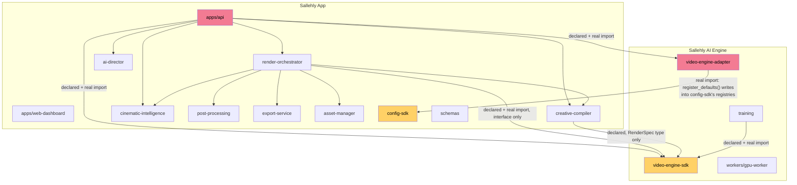
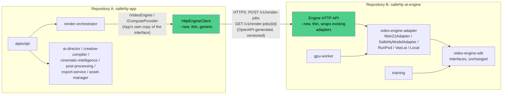

# Monorepo Split Plan: Sallehly App / Sallehly AI Engine

**Status:** Proposal — not yet approved, not yet executed. No files have been
moved. This document is the complete inspection, classification, and
migration plan requested before any split work begins.

**Method:** every claim below was checked against the actual repository
state on 2026-07-26 — every workspace `pyproject.toml`'s declared
dependencies parsed programmatically, every real Python `import` statement
of the two boundary-critical modules (`video_engine_sdk`,
`video_engine_adapter`) grepped and individually inspected (not just
pattern-matched — docstring mentions were checked and excluded from the
coupling list), and the test suite's actual imports read directly. Nothing
here is inferred from file/directory naming alone.

---

## 1. Classification

### 1.1 Sallehly App

| Path | Role |
|---|---|
| `apps/api` | Backend API — the App's composition root |
| `apps/web-dashboard` | Frontend (Next.js) |
| `services/ai-director` | Creative Director orchestrator (brief → story → scenes → shots) |
| `services/creative-brief-parser` | LLM-backed brief parsing |
| `services/story-planner` | LLM-backed story outline generation |
| `services/scene-builder`, `services/shot-planner` | Deterministic scene/shot decomposition |
| `services/camera-engine`, `services/lighting-engine`, `services/motion-engine`, `services/style-engine` | Deterministic per-shot planning directors |
| `services/storyboard-generator` | Storyboard assembly |
| `services/render-config-compiler` | RenderSpec generation (engine-agnostic) |
| `services/creative-compiler` | Orchestrates the above into a full creative pipeline |
| `services/cinematic-intelligence` | Consistency/continuity/quality engines |
| `services/post-processing` | Timeline, transitions, audio, subtitles, compositing, thumbnails, watermark |
| `services/export-service` | Final export + asset packaging |
| `services/asset-manager` | Storage-backed asset registration |
| `services/render-orchestrator` | `GenerationPipeline`, `ProjectLifecycle`, Temporal workflow — **consumes** `IVideoEngine`/`IComputeProvider`, never imports a concrete implementation (see §3.1) |
| `packages/schemas` | All App-domain JSON schemas (brief, storyboard, project, render_plan, quality_report, …) |
| `packages/config-sdk` | `Settings` + the generic `Registry` mechanism (see §3.2 — this one needs a real decision, not a rubber stamp) |
| `packages/auth`, `packages/persistence`, `packages/cache-sdk`, `packages/storage-sdk`, `packages/rate-limit-sdk`, `packages/quota-sdk`, `packages/observability` | Cross-cutting App infrastructure |
| `packages/cinematic-intelligence-sdk`, `packages/video-composition-sdk` | Type contracts for App-side subsystems |
| `packages/llm-providers`, `packages/prompt-engine`, `packages/director-memory` | Creative-direction LLM infrastructure |
| `libraries/prompt-library`, `libraries/prompt-templates`, `libraries/template-library` | Creative content assets |
| `plugins/llm-providers`, `plugins/post-fx` | Pluggability stubs for App-side subsystems |
| `docker-compose.yml`, most of `docs/`, most of `.github/workflows/` *(none exist yet for App — see §6)* | App infra/docs |

### 1.2 Sallehly AI Engine

| Path | Role |
|---|---|
| `packages/video-engine-sdk` | `IVideoEngine`, `IComputeProvider`, `RenderSpec`, job/output types — **the contract boundary itself** |
| `services/video-engine-adapter` | Concrete engines (`Wan21Adapter`, `SallehlyModelAdapter`) + concrete compute providers (RunPod, Vast.ai, Local) |
| `services/training` | Entire Phase 9 stack: dataset pipeline, model registry, evaluation framework, automation layer (Kaggle/Modal/cost-guard), Wan2.2 execution layer |
| `workers/gpu-worker` | Inference container run on GPU compute |
| `models/registry.yaml`, `models/wan2.1/` | Engine/capability-manifest metadata |
| `plugins/video-engines` | Pluggability stub for engines |
| `infra/runpod` | GPU provider deployment (currently a README stub) |
| `.github/workflows/training-phase{1,2,3}-*.yml` | Training automation CI (already Engine-only in content) |
| `docs/adr/0021`, `0022`, `0023` in full; `0002`, `0005` primarily | Training/engine-specific ADRs |

### 1.3 Shared — flagged, not rubber-stamped

Nothing is classified "Shared" without an explicit resolution, because "shared" is exactly the classification that
produces the coupling the user wants eliminated. Two candidates, both resolved below rather than left as TBD:

| Candidate | Resolution |
|---|---|
| `packages/video-engine-sdk` (`IVideoEngine`/`IComputeProvider`/`RenderSpec`) | **Becomes the published API contract**, not a shared Python package — see §5. Its *shape* is needed on both sides, but each side gets its own copy generated from one source of truth, not a live workspace link. |
| `packages/config-sdk`'s `VIDEO_ENGINE_REGISTRY`/`COMPUTE_PROVIDER_REGISTRY`/`video_engine`/`compute_provider` Settings fields | **Move to the App side only**, repurposed to hold engine-*client* configuration (base URL, API key) rather than engine-*implementation* selection — see §3.2 and §5. |

No other package is genuinely needed by both sides. `packages/schemas` (App-domain) and `packages/video-engine-sdk`
(Engine-domain contract) look similar in kind but serve disjoint purposes and don't need to merge.

---

## 2. Current dependency graph (as-is)



**Red = the two edges that actually cross the intended product boundary today.** Everything else in the App
subgraph is internally consistent and never touches Engine code.

---

## 3. Hidden couplings, circular relationships, and risks found

### 3.1 The one real App → Engine edge: `apps/api/src/api/state.py`

`GenerationPipeline` (render-orchestrator, App) is constructor-injected with an `IVideoEngine` +
`IComputeProvider` — it never imports `video_engine_adapter`, by design, and says so in its own docstring:

> "Neither CreativeDirector nor CreativeCompiler import this class or anything from services/video-engine-adapter -
> this is the one place those two abstract interfaces get bound to concrete implementations"

That "one place" is `apps/api/state.py`'s `build_app_state()`, which does exactly what the docstring says: it's the
only App-side file that imports `video_engine_adapter` at all (confirmed by grepping every real import of that
module across the whole tree — `apps/api/src/api/state.py` is the only App-side hit; every other match was a
docstring mention, not an import). **This is good news, not bad news** — the coupling is deliberately concentrated
in one composition-root file, not smeared across the codebase. It's a small, precise incision, not major surgery.

### 3.2 The one real Engine → App edge: `services/video-engine-adapter/src/video_engine_adapter/registry.py`

```python
from config_sdk import COMPUTE_PROVIDER_REGISTRY, VIDEO_ENGINE_REGISTRY
```

`video-engine-adapter`'s `register_defaults()` pushes `Wan21Adapter`/`SallehlyModelAdapter`/RunPod/Vast.ai/Local
into two registry instances that live inside `config-sdk` — an App-side package. This is the mirror image of §3.1:
Engine code reaching into App code. Together, §3.1 and §3.2 form the actual coupling the user is asking to remove —
not a Python-level circular import (nothing today imports both directions in the same module graph, so `uv sync`
doesn't fail), but a **product-level circular dependency**: App needs Engine to register itself; Engine needs App's
registry to register into.

### 3.3 `config-sdk`'s `Registry` mechanism is App-generic; `VIDEO_ENGINE_REGISTRY`/`COMPUTE_PROVIDER_REGISTRY` are Engine-specific instances of it

`config-sdk` hosts nine registries total. Seven (`LLM_PROVIDER_REGISTRY`, `TRANSITION_PLUGIN_REGISTRY`,
`CONDITIONING_ADAPTER_REGISTRY`, `EMBEDDING_PROVIDER_REGISTRY`, `PROMPT_TRANSLATOR_REGISTRY`,
`REPAIR_STRATEGY_REGISTRY`, `QUALITY_METRIC_REGISTRY`) are genuinely App-internal — nothing Engine-side ever touches
them. Two (`VIDEO_ENGINE_REGISTRY`, `COMPUTE_PROVIDER_REGISTRY`) exist purely so the App can select which Engine
implementation to call. Once the split happens and App no longer imports `video_engine_adapter`, these two
registries have nothing left to hold — they need to be repurposed (§5) rather than deleted outright, since App still
needs *some* config-driven way to select "which Engine deployment am I calling."

### 3.4 Namespace confusion risk: two unrelated things both called "model adapter"

`services/video-engine-adapter` (Engine: Wan2.1/Sallehly video-generation model adapters) and
`cinematic_intelligence.model_adapters` (App: CLIP/DINO embedding + ControlNet/IP-Adapter conditioning adapters,
tested in `tests/test_model_adapters.py`) are two completely unrelated modules that both use "model adapter"
terminology. They don't currently collide (different package names, different import paths), but this is exactly
the kind of naming collision that becomes a real problem once two people/teams are working in two separate repos
without the current single-tree visibility. **Recommendation:** rename `cinematic_intelligence.model_adapters` to
something unambiguous (e.g. `cinematic_intelligence.perception_adapters`) as part of the App-side cleanup, purely to
remove the naming collision risk — not required for the split to function, but cheap insurance against future
confusion once the two codebases stop being visible to each other in one search.

### 3.5 Test files that span the boundary and cannot simply be "moved"

Grepping every test file's actual imports found three that currently import `video_engine_adapter` directly:

- **`tests/test_generation_pipeline.py`** — imports `render_orchestrator.GenerationPipeline` (App) *and*
  `video_engine_adapter.adapters.Wan21Adapter` + `video_engine_adapter.compute.LocalProvider` (Engine) to prove the
  pipeline drives a real engine correctly end-to-end.
- **`tests/test_video_engine_swap.py`** — imports `api.state.build_app_state` (App) *and*
  `video_engine_adapter.register_defaults`/`SallehlyModelAdapter`/`Wan21Adapter` (Engine) to prove config-driven
  engine swapping works.
- **`tests/test_model_adapters.py`** — despite the name, this one does *not* cross the boundary; it only imports
  `cinematic_intelligence.model_adapters` (App-side, see §3.4) and `config_sdk`. Flagged here only to document that
  it was checked and cleared, given the naming collision in §3.4.

Neither of the first two can be relocated as-is into either repo post-split — the App repo won't have
`video_engine_adapter` to import, and the Engine repo won't have `render_orchestrator`/`api.state` to import. Both
need to be **split into two independent tests**, not moved wholesale (see §7, Phase 4). This project already has the
right precedent for how to do this correctly: `services/training/evaluation/benchmark.py`'s `BenchmarkRunner`
deliberately reimplements the four-call `IVideoEngine`/`IComputeProvider` dance directly, rather than depending on
`render_orchestrator.GenerationPipeline`, specifically to avoid pulling App's dependency closure into
Engine-side test code. The Engine-side half of both tests should follow that same pattern; the App-side half should
be rewritten against a small in-repo fake `IVideoEngine`/`IComputeProvider` (something this codebase doesn't have
yet — the App repo needs one, since it currently borrows `LocalProvider`/`Wan21Adapter` for this purpose everywhere,
which won't be available post-split).

### 3.6 Config/environment files mix both domains in one file

- **`.env.example`**: `VIDEO_ENGINE`, `COMPUTE_PROVIDER`, `RUNPOD_API_KEY`, `RUNPOD_ENDPOINT_ID`, `VASTAI_API_KEY`,
  `VASTAI_INSTANCE_HOST` sit alongside `DATABASE_URL`, Redis, MinIO/S3, Temporal, auth, and rate-limit settings in
  one flat file.
- **`configs/environments/local.yaml`** (and presumably `production.example.yaml`): a `video:` block
  (`engine: wan2.1`, `compute_provider: local`) sits alongside `llm:`, `storage:`, `workflow:` blocks.

Both need to be split along the same line as the code: Engine-specific keys move to the Engine repo's own
`.env.example`/environment config; the App repo's copy either drops the video/compute keys entirely (if going fully
communication-free) or replaces them with client-shaped keys (`AI_ENGINE_BASE_URL`, `AI_ENGINE_API_KEY` — see §4).

### 3.7 One undeclared dependency found (not boundary-crossing, but worth fixing regardless)

While tracing every real import against every declared `pyproject.toml` dependency, no additional *undeclared*
cross-package imports were found beyond §3.1/§3.2 (both of which *are* declared, just architecturally wrong
direction — `video-engine-adapter`'s dependency on `config-sdk` is declared in its `pyproject.toml`, and
`apps/api`'s dependency on `video-engine-adapter` is declared in its `pyproject.toml`; the problem is that they
exist at all, not that they're hidden). This is worth stating plainly: **the coupling is 100% declared and
intentional in the current single-repo design** (it's exactly how ADR 0001/0002/0009's engine-swappability was
implemented) — nothing was found silently working only because of `uv`'s shared-venv behavior. That makes this split
mechanically simpler than a typical "accidentally coupled monorepo," since there's no dependency masquerading as
absent.

### 3.8 Docs and ADRs currently narrate one shared history

23 ADRs cover both products' entire design history in one numbered sequence. Several (0001, 0002, 0009, 0014) are
specifically *about* the App/Engine boundary itself and are meaningful to both repos' readers; most are
single-domain. `docs/DECISIONS.md`'s 100 rows and `docs/ARCHITECTURE.md` have the same problem. This isn't a code
risk, but it is real migration work — see §7 Phase 6.

---

## 4. The one decision I cannot make for you

Every finding above assumes an answer to a question the request's wording leaves genuinely ambiguous, and the answer
changes what "Phase 3: sever the composition root" (§7) actually produces.

**Sallehly App's core feature is turning a creative brief into a rendered video.** That fundamentally requires
invoking *some* video-generation capability. "The AI Engine must not know anything about the App" and "the App must
not contain any AI Engine code" are both achievable and are what this plan delivers regardless of the answer below —
but "I do not want communication between them" is a stronger statement that, taken completely literally, means
Sallehly App can never actually generate a video after the split, because there would be no channel left for it to
reach any engine at all.

Three real options, ranked by how literally they honor "no communication":

1. **API-boundary split (recommended).** App and Engine are fully independent repos with zero shared code and zero
   compile-time dependency. At *deploy* time, App's `GenerationPipeline` calls the Engine over a stable, versioned
   HTTP API (OpenAPI-generated from `video-engine-sdk`'s existing `RenderSpec`/`IVideoEngine`/`IComputeProvider`
   shapes) — the same relationship App would have with any third-party model API it didn't own. Engine genuinely has
   zero knowledge of App (true). App genuinely contains zero engine code — no adapters, no compute providers, no
   training code, just a generic typed HTTP client (true). This is what "two independent products" means at almost
   every real company that separates an app from an ML platform. It does mean the two are not communication-free in
   the network sense.
2. **Fully communication-free.** No channel of any kind. Sallehly App's rendering feature is removed or permanently
   stubbed; it becomes a creative-planning-only product. A human (or an entirely separate, unrelated process) is
   whatever bridges the two. This is the only option that satisfies "no communication" literally.
3. **Indirect/asynchronous boundary.** App writes render requests to shared infrastructure (a queue, a bucket
   prefix, a shared table) that Engine polls independently, with no direct service-to-service call in either
   direction. This avoids a *direct* API call, but the shared infrastructure and its schema is itself a coupling —
   arguably harder to keep clean than option 1, not easier.

This plan is written to work under option 1, since it's the only one that keeps Sallehly App a functioning video
generation product and matches how "independent product" is used everywhere else in the request (repos, packages,
imports, namespaces — never "features"). Everything in §5-§7 should be read as the option-1 plan. If you mean option
2, tell me and I'll rewrite §5-§7 around removing the render feature from App entirely instead of replacing its
transport.

---

## 5. Target architecture (option 1)



**What's new (doesn't exist today):**
- `sallehly-app`: a thin `HttpEngineClient` implementing the *same* `IVideoEngine`/`IComputeProvider`-shaped
  interface `GenerationPipeline` already expects — swapping `video_engine_adapter.Wan21Adapter` for
  `HttpEngineClient` at the one composition-root line identified in §3.1. `GenerationPipeline` itself needs zero
  changes; this is precisely why ADR 0001/0002's interface segregation exists.
- `sallehly-ai-engine`: a thin HTTP API service wrapping the existing `video_engine_adapter` registry — essentially
  `apps/api`'s current `/generation` route logic, minus everything else `apps/api` does, moved to a new, minimal
  FastAPI app that lives in the Engine repo. Generated from (or hand-written to match) an OpenAPI spec derived
  directly from `video-engine-sdk`'s existing types, so the contract has one source of truth even though the code
  exists twice.

**What's deleted:** `apps/api`'s direct import of `video_engine_adapter` (§3.1). `video-engine-adapter`'s import of
`config_sdk` (§3.2) — the Engine repo gets its own tiny local registry (a five-line copy of `config-sdk`'s generic
`Registry` class, which is small enough that duplicating *that one class* is cheaper and more honest than either
repo depending on the other for it; the `Registry` class itself has zero dependencies and is ~30 lines).

**What's duplicated, deliberately, instead of shared:** the `IVideoEngine`/`IComputeProvider`/`RenderSpec` *shape*.
Both repos need it; neither should import the other's package to get it. Generate both copies from one OpenAPI spec
(kept in whichever repo owns the contract — recommend the Engine repo, since it's the API provider) so "duplicated"
means "generated twice from one source," not "hand-maintained twice and prone to drift."

---

## 6. Exact migration order

Each phase leaves the single repo in a working, fully-tested state — this is a sequence of PRs against the current
repo, not a single big-bang cut. The actual repo split (git history extraction into two remotes) is the *last* step,
once everything downstream of it is already true in the single repo.

1. **Freeze a compatibility snapshot.** Tag the current commit before any structural change, so there's a clean
   rollback point and a reference for verifying nothing behavioral changed along the way.
2. **Write the OpenAPI contract** for the render-job API (`POST /v1/render-jobs`, `GET /v1/render-jobs/{id}`,
   matching `RenderSpec` in → `EngineJobOutput`/`RawClip` out) derived from `video-engine-sdk`'s existing types. This
   becomes the one source of truth §5 depends on.
3. **Build `HttpEngineClient`** in `services/render-orchestrator` (or a new small App-side package) implementing
   `IVideoEngine`+`IComputeProvider` against that contract, tested against a mocked HTTP transport (same pattern
   already used for `RunPodProvider`/`KaggleClient`/`ModalJobLauncher` in this codebase — nothing new to invent).
   Still calls the *existing* in-repo `video_engine_adapter` under the hood via a temporary local HTTP server in
   dev/test, so nothing user-facing changes yet.
4. **Build the standalone Engine HTTP API app** inside `services/video-engine-adapter` (or a new
   `services/engine-api`), implementing the same OpenAPI contract, backed by the *existing* adapter registry. Prove
   it end-to-end against `HttpEngineClient` from step 3 — this is the point where the two sides of the future
   repo boundary first talk over HTTP instead of a Python import, still inside one repo.
5. **Cut over `apps/api/state.py`** to construct `HttpEngineClient` instead of importing `video_engine_adapter`
   directly. Delete that import. This resolves §3.1.
6. **Remove `video-engine-adapter`'s dependency on `config-sdk`** (§3.2): give it its own minimal local `Registry`
   copy (or drop the registry indirection entirely now that nothing outside its own new HTTP API app needs to
   discover it dynamically — the HTTP API app can just import the concrete adapter classes directly, since it will
   live in the Engine repo where that's no longer a boundary violation).
7. **Split the two boundary-spanning tests** (§3.5): rewrite `test_generation_pipeline.py`'s App half against a new
   in-repo fake engine; move its Engine-adapter-conformance half to `services/training/evaluation`-style real
   adapter tests. Rewrite `test_video_engine_swap.py` similarly — an App-side test proving `HttpEngineClient`
   round-trips correctly against a fake server, and an Engine-side test proving the registry/HTTP API correctly
   serves both `Wan21Adapter` and `SallehlyModelAdapter`.
8. **Split config/env files** (§3.6): remove `VIDEO_ENGINE`/`COMPUTE_PROVIDER`/`RUNPOD_*`/`VASTAI_*` from the
   App-side `.env.example`, replace with `AI_ENGINE_BASE_URL`/`AI_ENGINE_API_KEY`. Engine repo gets its own
   `.env.example` with the removed keys.
9. **Full-suite verification** in the still-single repo: every test green, `apps/api` no longer imports
   `video_engine_adapter` anywhere (grep-verifiable), `video-engine-adapter` no longer imports `config_sdk`
   anywhere. This is the actual proof the split is safe, obtained *before* touching git history.
10. **Split docs** (§3.8): duplicate the boundary-relevant ADRs (0001, 0002, 0009, 0014) into both repos as
    historical record with a note on which repo now owns the live code; partition `DECISIONS.md`/`ARCHITECTURE.md`
    rows by which repo the referenced code now lives in.
11. **Extract git history into two repos.** With every dependency edge already resolved in steps 1-10, this becomes
    a mechanical `git filter-repo`/subtree-split per target repo path list (§1.1 vs §1.2), not a debugging exercise.
    Two new remotes (`sallehly-app`, `sallehly-ai-engine`), each pushed with its own preserved history for the files
    it owns.
12. **Stand up independent CI** in each new repo (`sallehly-app` gets its own test/lint workflow; the training-phase
    workflows already only reference Engine-side paths and move to `sallehly-ai-engine` unchanged).
13. **Verify both repos build and test independently** with no reference to the other's path, package name, or
    remote — the actual acceptance criterion for "the repositories must compile independently."

---

## 7. Post-split acceptance checklist

- [ ] `sallehly-app`'s `uv sync`/`pytest` succeed with zero network access to, or filesystem knowledge of, `sallehly-ai-engine`'s path.
- [ ] `sallehly-ai-engine`'s `uv sync`/`pytest` succeed identically, with zero knowledge of `sallehly-app`.
- [ ] `grep -r "video_engine_adapter" sallehly-app/` returns nothing outside test fixtures/mocks (if any survive intentionally) — zero real imports.
- [ ] `grep -r "config_sdk\|render_orchestrator\|api\.state" sallehly-ai-engine/` returns nothing.
- [ ] No package name collision between the two repos' own internal package names (verified — none found; every
      package name across both classifications in §1 is already unique).
- [ ] The OpenAPI contract from §5/§6 has exactly one source of truth, referenced (not copy-pasted ad hoc) by both
      repos' generated clients/servers.
- [ ] `docs/DECISIONS.md` rows in each repo only reference that repo's own ADRs.

---

## 8. What this plan deliberately does not do yet

Per the request: no files have been moved, no repo has been created, no import has been changed. This document is
the plan only. §4's open question needs an answer before Phase 3 (§6 step 3 onward) can start, since it determines
whether the App repo ends up with a working render feature or not.
