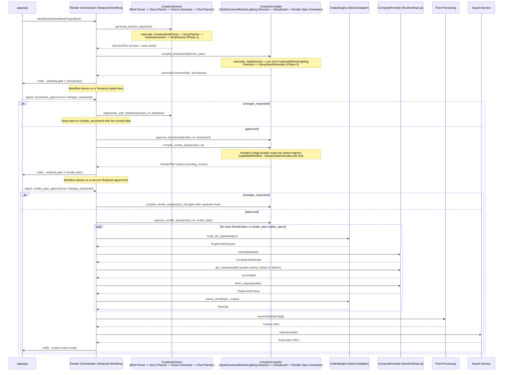

# AI Director / Render Workflow

Owned by `services/render-orchestrator`, implemented as a Temporal
workflow (see ADR 0004). This is the single durable process that carries
one project from a submitted brief to a finished export. As of Phase 2,
everything up to and including both approval gates is implemented and
tested outside of Temporal (`tests/test_creative_pipeline.py`,
`tests/test_creative_compiler.py`); this document describes how the
still-unbuilt Render Orchestrator (Phase 4) will drive those already-real
components.

## Workflow steps

## Why this is a Temporal workflow and not a simple task queue

- **Durability:** a render can take minutes; if a worker process
  restarts mid-poll, Temporal resumes exactly where it left off.
- **Both approval gates are first-class waits, not poll loops.** The
  workflow blocks on `storyboard_approved`/`changes_requested` and later
  `render_plan_approved`/`changes_requested` signals from `apps/api`
  endpoints (see `docs/api/openapi.yaml` - gate 2's endpoints are a
  Phase 3/4 addition to that contract) for as long as it takes a human to
  respond - hours or days, not just seconds.
- **Per-shot retry policy:** a transient RunPod/Vast.ai failure retries
  that one shot's activity, not the whole project.

## Cost control built into this flow

Camera/Motion/Lighting/Style planning and the Storyboard Generator are
all deterministic (no LLM call, see ADR 0007/0008), so gate 1 costs
essentially nothing to reach. Gate 2 (render plan) is the last checkpoint
before any GPU cost is spent - `RenderSpec.quality_tier` (see
`packages/schemas/json/render_configuration.schema.json`) additionally
allows a cheap/fast `"preview"` render tier if a visual preview is wanted
before committing to `"final"` quality.

## Swap points touched by this workflow

Per ADR 0001/0002, this workflow's activities call `ILLMProvider` (via
`CreativeDirector`), `IVideoEngine`, and `IComputeProvider` purely through
their interfaces. The workflow definition itself never imports Claude,
Wan2.1, RunPod, or Vast.ai specifics - only `services/ai-director`,
`services/creative-compiler`, and `services/video-engine-adapter` do.
