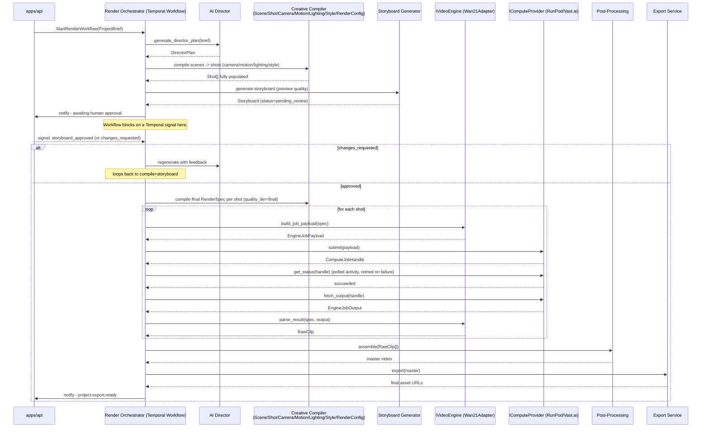

# AI Director / Render Workflow

Owned by `services/render-orchestrator`, implemented as a Temporal
workflow (see ADR 0004). This is the single durable process that carries
one project from a submitted brief to a finished export.

## Workflow steps

## Why this is a Temporal workflow and not a simple task queue

- **Durability:** a render can take minutes; if a worker process
  restarts mid-poll, Temporal resumes exactly where it left off.
- **The human approval gate is a first-class wait, not a poll loop.**
  The workflow blocks on `storyboard_approved` / `changes_requested`
  signals from `apps/api`'s
  `POST /projects/{id}/storyboard/approve` and
  `POST /projects/{id}/storyboard/request-changes` endpoints
  (see `docs/api/openapi.yaml`) for as long as it takes a human to
  respond — hours or days, not just seconds.
- **Per-shot retry policy:** a transient RunPod/Vast.ai failure retries
  that one shot's activity, not the whole project.

## Cost control built into this flow

The Storyboard Generator step runs *before* any full-cost render, and
uses `quality_tier=preview` in any `RenderSpec` it needs for preview
imagery. Nothing expensive happens until a human explicitly approves —
this is the same `RenderSpec.quality_tier` mechanism documented in
`packages/schemas/json/render_configuration.schema.json`.

## Swap points touched by this workflow

Per ADR 0001/0002, this workflow's activities call `ILLMProvider` (via
`AIDirector`), `IVideoEngine`, and `IComputeProvider` purely through their
interfaces. The workflow definition itself never imports Claude, Wan2.1,
RunPod, or Vast.ai specifics — only `services/ai-director` and
`services/video-engine-adapter` do.
